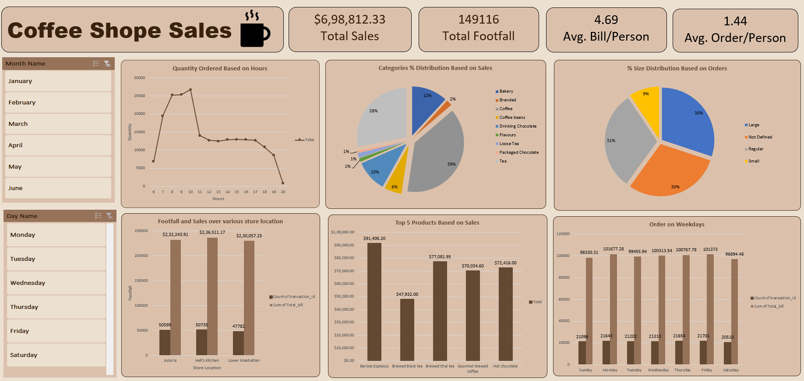

# ☕ Coffee Shop Sales Dashboard (Excel)

## 📊 Project Overview
This project showcases an **interactive Coffee Shop Sales Dashboard** built entirely using **Microsoft Excel**.  
The dashboard helps analyze sales performance, customer behavior, and product trends using real-world transactional data.

## 🛠 Tools Used
- Microsoft Excel
- Pivot Tables
- Pivot Charts
- Slicers
- Data Cleaning & Analysis
- Dashboard Design

## 📁 Dataset
The dataset includes:
- Order Date & Time
- Store Location
- Product Category
- Product Size
- Quantity Sold
- Total Bill

📂 Raw data is available in the `data/` folder.

## 📈 Dashboard Features
- KPI Cards (Total Sales, Footfall, Avg Bill)
- Hourly sales trend analysis
- Category-wise sales distribution
- Product size distribution
- Store-wise performance comparison
- Top 5 products by sales
- Weekday vs Weekend analysis
- Interactive slicers (Month & Day)

## 🖼 Dashboard Preview

## 🔍 Key Insights
- Morning hours generate maximum revenue
- Coffee products dominate overall sales
- Large and Regular sizes are most popular
- Hell's Kitchen store performs best
- Sales are stronger on weekdays

## 🚀 How to Use
1. Download or clone the repository
2. Open `dashboard/Coffee_Shop_Sales_Dashboard.xlsx`
3. Use slicers to explore insights interactively

## 📌 Skills Demonstrated
- Excel Data Analysis
- Dashboard Design
- Business Insight Generation
- Sales Performance Analysis
